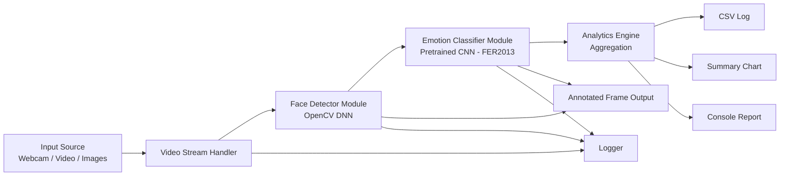
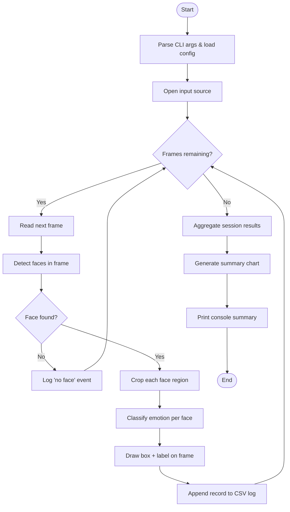
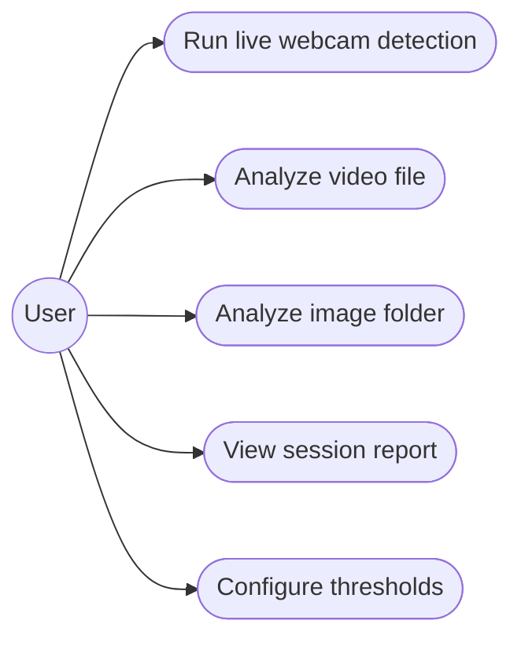
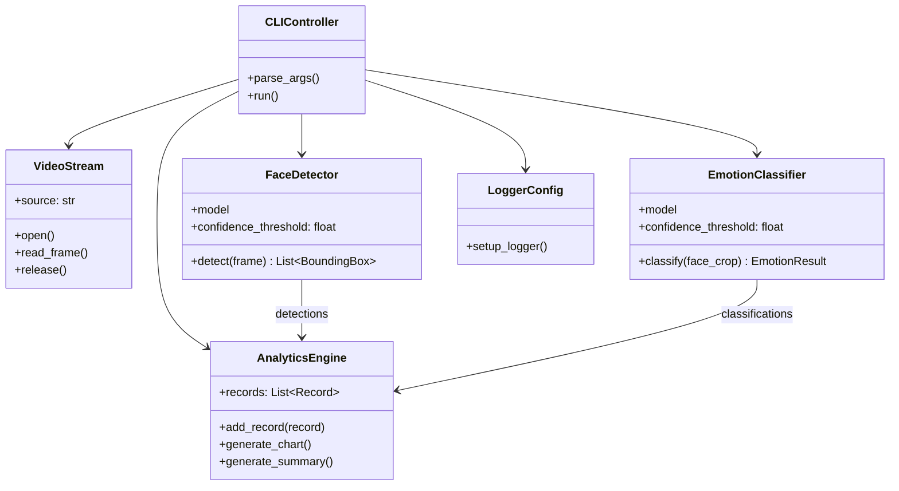
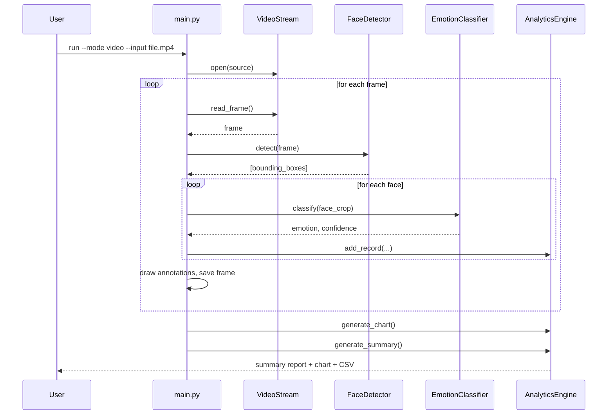

# Design Diagrams

These render natively on GitHub. Paste the same Mermaid blocks into your project report (Word/PDF), or export as PNG (see note at bottom) for the report if your report tool doesn't support Mermaid.

## 1. System Architecture Diagram

## 2. Process / Workflow Diagram

## 3. Use Case Diagram

## 4. Class / Component Diagram

## 5. Sequence Diagram (single frame processing)

---
### Note on exporting to PNG for the PDF report
If your report tool doesn't render Mermaid, paste any block above into the free [Mermaid Live Editor](https://mermaid.live), export as PNG/SVG, and embed the image in your report instead.
